import YouTubeEmbed from "../../../components/YouTubeEmbed.astro";

A super-coiled polymer (cxSPA) actuator is an alluring idea. Instead of having a simple string being pulled by an electric motor, why not embed the actuation mechanism in the material itself? Just like animal muscles.

### Making coaxial super-coiled polymer actuator (cxSPA) cheap and accessible

Of course, with almost no budget, I wouldn't get far without thinking of how I could repurpose something affordable and accessible for a regular hacker on a budget. After all, these Coaxial Super-coiled Polymer Actuators (CoSPA) should be possible to make in a home lab setting.

### Rough Plan

I plan on tweaking a 3D printer extruder a little bit by inserting a tiny syringe needle (or some centering mechanism) in the center of an extruder nozzle and feed a nichrome wire through it, with melted nylon flowing/extruding from around it throught the nozzle, pulling the wire with it and embedding it in the core of the newly extruded nylon fiber.

### Mechanical/thermal property implications of remelting and drawing of nylon fiber

### Twisting setup

<YouTubeEmbed id="4HUenCeSx1Q" title="TCA twisting setup 1" />
<YouTubeEmbed id="D6WQnWQOB_M" title="TCA twisting setup 2" />

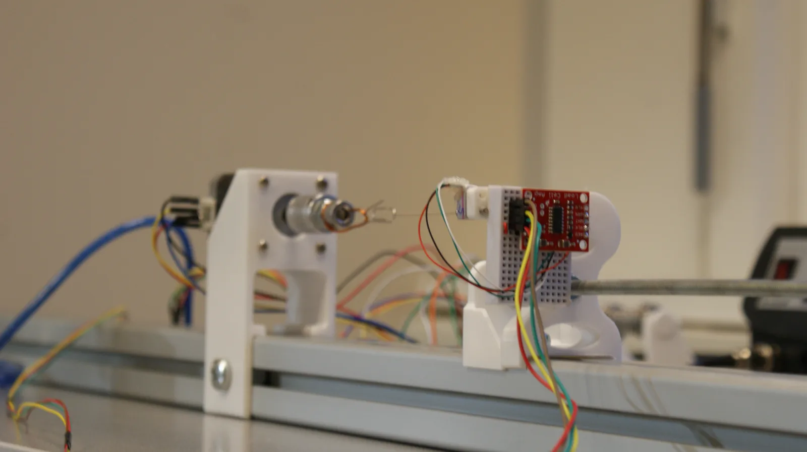
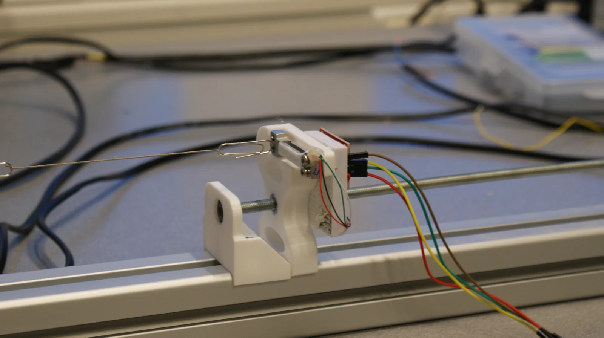
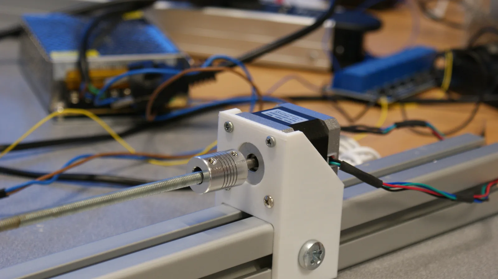
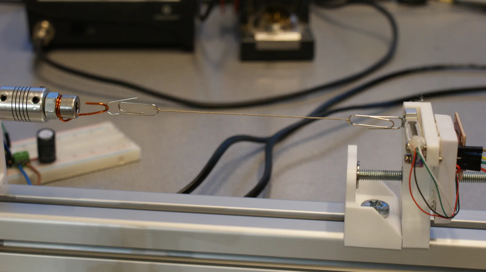

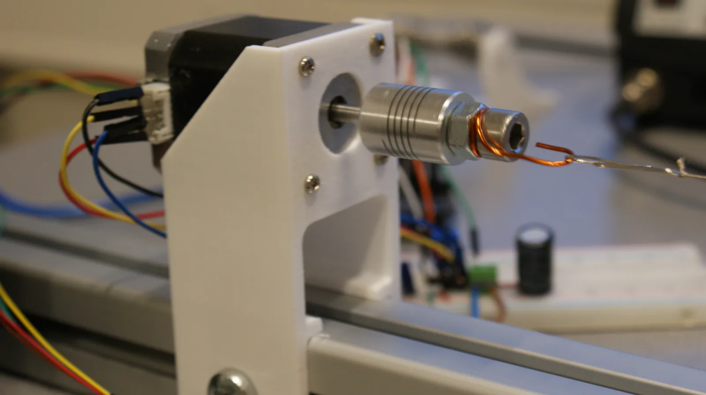
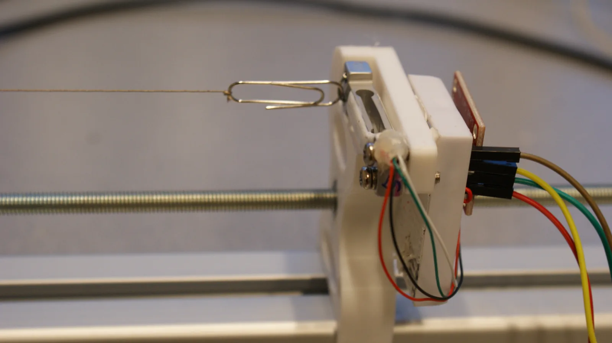
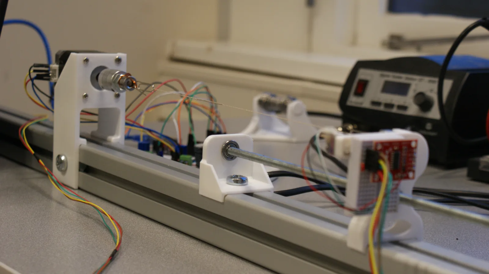

### Tests

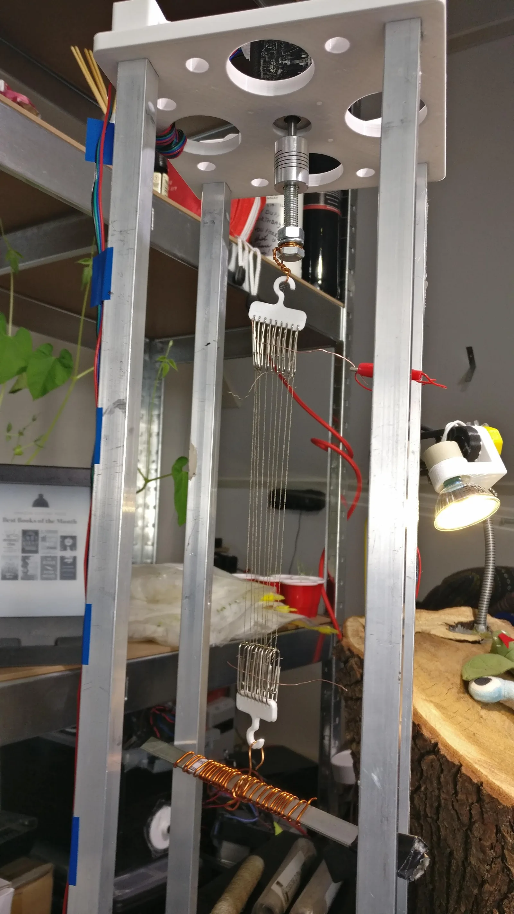
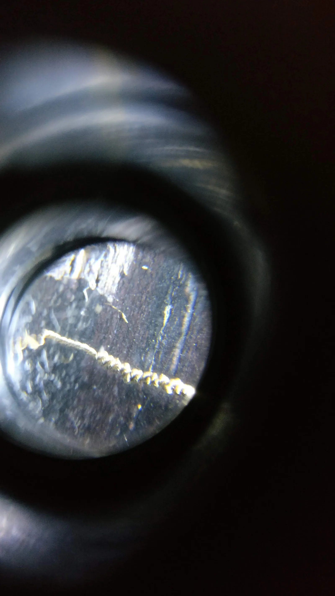
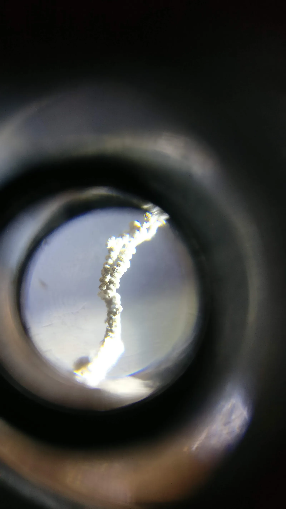
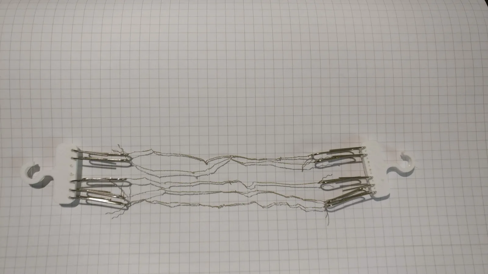

<video controls preload="metadata" class="my-4 w-full max-w-3xl">
  <source src="/videos/VID_1.mp4" type="video/mp4" />
</video>

<video controls preload="metadata" class="my-4 w-full max-w-3xl">
  <source src="/videos/VID_2.mp4" type="video/mp4" />
</video>

<video controls preload="metadata" class="my-4 w-full max-w-3xl">
  <source src="/videos/VID_3.mp4" type="video/mp4" />
</video>

<video controls preload="metadata" class="my-4 w-full max-w-3xl">
  <source src="/videos/VID_4.mp4" type="video/mp4" />
</video>

<video controls preload="metadata" class="my-4 w-full max-w-3xl">
  <source src="/videos/VID_5.mp4" type="video/mp4" />
</video>

<video controls preload="metadata" class="my-4 w-full max-w-3xl">
  <source src="/videos/VID_6.mp4" type="video/mp4" />
</video>

<video controls preload="metadata" class="my-4 w-full max-w-3xl">
  <source src="/videos/VID_7.mp4" type="video/mp4" />
</video>